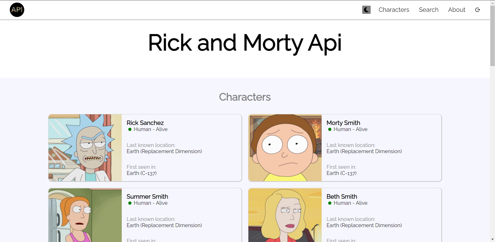
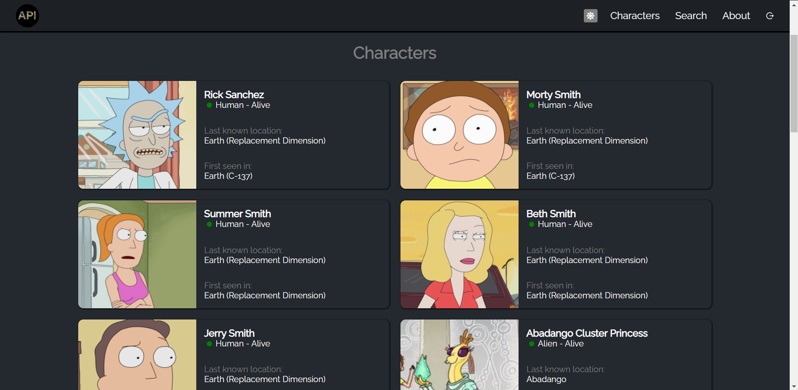

## Table of contents
- [Overview](#overview)
  - [Execute Project](#Execute-Project)
  - [Links](#links)
  - [Images](#images)
- [My process](#my-process)
  - [Built with](#built-with)
- [Author](#author)

## Execute project

## Available Scripts

In the project directory, you can run:

### `npm start`

Runs the app in the development mode.\
Open [http://localhost:3000](http://localhost:3000) to view it in the browser.

The page will reload if you make edits.\
You will also see any lint errors in the console.

## Link

- Solution URL: [http://rick-and-morty-api-frontend.vercel.app/]

## Images

lightMode

darkMode

## My process

### Built with

- Semantic HTML5 markup
- CSS custom properties
- Flexbox
- React

## Author
[@danieljacquin]
